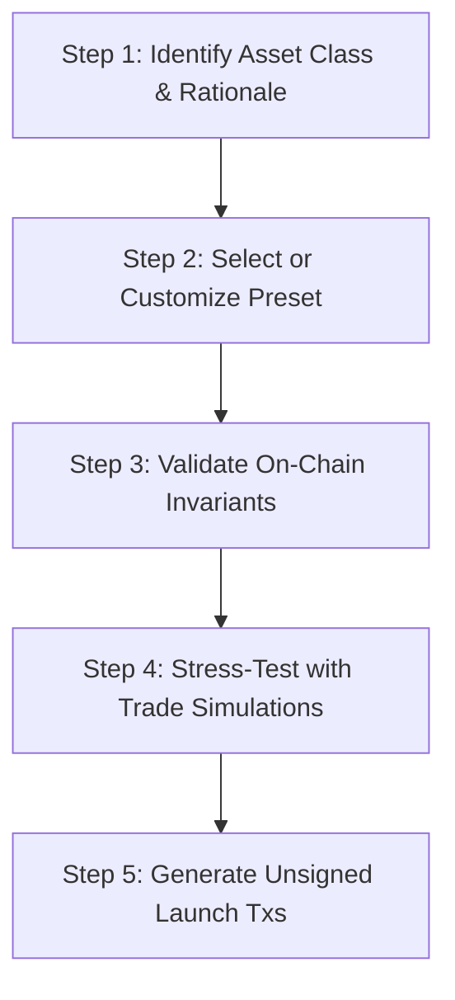

# Curve Studio: Meteora Bonding Curve Agent Skill

Use this skill when you want to design, validate, simulate, compare, or deploy tokens on **Meteora Dynamic Bonding Curve (DBC)** that automatically migrate into **DAMM v2 (cp-amm)** and optionally **DLMM (lb_clmm)** liquidity pools on Solana.

---

## 1. Core Workflow for Agents

Follow this 5-step operational pipeline when tasked with token launches or curve modeling:



### Step 1: Select the Appropriate Financial Preset
Do NOT launch all tokens with meme parameters. Pick a mechanism matched to the financial asset class:

| Asset Class | Recommended Preset | Curve Shape | Initial Fee | Liquidity Lock |
|-------------|-------------------|-------------|-------------|----------------|
| **Equity / Tokenized Stock** | `stock-price-discovery` | 2-segment gentle linear | Flat 25 bps | 100% permanent DAMM v2 lock |
| **Community / Meme** | `fair-meme` | 2-segment exponential | 500 bps -> 100 bps anti-snipe | 20% float, 80% locked |
| **Real World Asset (RWA)** | `rwa-long-tail` | 4-segment accumulation | 50 bps flat | 85% locked, 15% custody fee |
| **Autonomous AI Agent** | `ai-agent-token` | 3-segment exponential | 100 bps flat | 25% compute treasury share |
| **Conviction / Staking** | `conviction-pool` | 2-segment linear | 30 bps flat | DAMM v2 + DLMM secondary |

### Step 2: Retrieve Preset Details
Call `get_preset(presetId)`:
```json
{
  "presetId": "stock-price-discovery"
}
```
Returns preset rationale, default builder parameters, and verified DBCConfig.

### Step 3: Enforce On-Chain Invariants Before Launch
Always call `validate_config(config)`.
Meteora DBC program enforces strict on-chain validation:
1. **Fee Range**: `startingFeeBps` and `endingFeeBps` MUST be >= 25 bps (0.25%) and <= 9,900 bps (99%). Anything below 25 bps is rejected on-chain with `FEE_TOO_LOW`.
2. **Liquidity Distribution**: `partnerPermanentLockedLiquidityPercentage + creatorPermanentLockedLiquidityPercentage + creatorLiquidityPercentage` MUST equal **exactly 100%**.
3. **Migration Option**: Must be `MigrationOption.MET_DAMM_V2` (v1 is deprecated).
4. **Segment Monotonicity**: Sqrt prices in curve segments must be strictly monotonically increasing.
5. **Decimals Compatibility**: Base decimals must be 6, 7, 8, or 9.

### Step 4: Simulate Under Market Stress
Call `simulate_config` with an archetype:
- `whale_dump`: Tests if a massive early holder dumping causes catastrophic slippage or if liquidity absorption holds.
- `retail_fomo`: Tests rapid multi-wallet retail inflow.
- `steady_accumulation`: Verifies predictable price discovery and graduation trajectory.

Example MCP Tool Call:
```json
{
  "presetId": "stock-price-discovery",
  "scenario": "steady_accumulation",
  "tradeCount": 30
}
```

Evaluate output metrics:
- `fairnessScore`: Gini-derived holder distribution (closer to 1.0 is more decentralized).
- `sniperResistanceScore`: 0-100 rating based on initial anti-snipe fee decay.
- `maxDrawdownPercent`: Maximum peak-to-trough drop during trading.
- `isGraduated`: Confirms whether the target quote reserve was attained.

### Step 5: Build Launch Transactions (Zero Private Keys)
Call `build_launch_tx`:
```json
{
  "config": "<validated_config_object>",
  "payer": "<user_or_agent_solana_public_key>",
  "name": "Acme Equity Token",
  "symbol": "ACME",
  "uri": "https://metadata.example.com/acme.json",
  "network": "devnet"
}
```

> [!CAUTION]
> **Safety Guard**: Mainnet deployments require `network: "mainnet-beta"` AND the exact confirmation string `"mainnetConfirmation": "DEPLOY TO MAINNET"`. Calls without this parameter are strictly aborted.

The tool outputs two base64-encoded serialized transactions:
1. `unsignedConfigTxBase64`: Creates the DBC configuration account on-chain.
2. `unsignedPoolTxBase64`: Initializes the virtual bonding curve pool and base token mint.

Pass these unsigned transactions to the user's connected wallet adapter or sign locally using a secure key management vault.

---

## 2. Available MCP Tools Reference

| Tool Name | Purpose | Key Inputs |
|-----------|---------|------------|
| `list_presets` | Browse available curve presets | `assetClass?` |
| `get_preset` | Inspect parameters & economic rationale | `presetId` |
| `validate_config` | Run invariant checks against DBC program rules | `config` |
| `simulate_config` | Run simulated trade sequences and calculate metrics | `presetId?`, `config?`, `scenario?`, `tradeCount?` |
| `compare_configs` | Benchmark 2-3 presets side-by-side | `presets`, `tradeCount?` |
| `build_launch_tx` | Produce unsigned transactions for Solana launch | `config`, `payer`, `name`, `symbol`, `uri`, `network?` |
| `get_pool_state` | Read real-time on-chain reserves and graduation progress | `poolAddress`, `network?` |

---

## 3. Post-Launch Monitoring & Liquidity Migration

Once deployed, DBC pools accumulate quote asset (SOL or USDC) from trades until reaching the migration threshold:
1. Once 100% of the target reserve is reached, the pool locks DBC swaps.
2. Call `DbcAdapter.buildMigrateToDammV2Tx({ poolAddress, payer, dammConfig })` to execute atomic migration into Meteora DAMM v2 (`cp-amm`).
3. Permanent locked LP tokens are minted directly into the burn/lock address according to the preset percentages.
4. If the preset configured a secondary DLMM conviction pool (e.g. `conviction-pool`), stakers lock tokens to earn concentrated bin LP yields.
