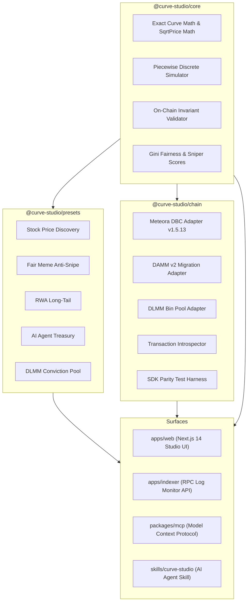

# Curve Studio 📐⚡

**Financial-Grade Bonding Curve Toolkit & Launch Infrastructure for Meteora DBC, DAMM v2, and DLMM on Solana**

Built for the **Crypto World's Fair x Meteora Hackathon** (Superteam Earn).

[](https://www.typescriptlang.org/)
[](https://turbo.build/)
[](https://vitest.dev/)
[](https://meteora.ag)
[](https://meteora.ag)
[](https://meteora.ag)
[](https://solana.com)

---

## 🌟 Executive Summary

**Curve Studio** is an open-source platform, financial modeling engine, and developer toolkit for launching tokens on **Meteora's Dynamic Bonding Curve (DBC)** that seamlessly migrate into **DAMM v2 (`cp-amm`)** and **DLMM (`lb_clmm`)** liquidity pools on Solana.

While existing launchpads treat bonding curves as simple meme lottery tickets with flat, exploitable parameters, **Curve Studio** unlocks the full institutional power of Meteora's piecewise virtual constant-product curve engine. It enables founders, DAOs, and autonomous AI agents to design, simulate, validate, and deploy tokens with bespoke economic profiles for:
- 📈 **Tokenized Equities & Stocks**: Gentle linear price discovery with permanent locked DAMM v2 liquidity and flat institutional trading fees.
- 🏢 **Real World Assets (RWAs)**: Shallow accumulation bands, fractional ownership float, and ongoing custody/appraisal fee splits.
- 🤖 **Autonomous AI Agents**: Dynamic fee routing directly to on-chain agent treasuries for inference and compute sustainability.
- 🛡️ **Fair Community Launches**: Anti-snipe exponential fee decay schedulers that neutralize MEV sandwich bots and penalize predatory block-0 snipers.
- 🎯 **Dual-Stage Conviction Pools**: Post-graduation liquidity routed into secondary **Meteora DLMM** concentrated liquidity pools for staker yield.

---

## 🏛️ System Architecture

Curve Studio is engineered as a clean Turborepo monorepo sharing a single mathematically validated core library across web, indexing, and agent surfaces:



---

## 📦 Packages & Workspace Layout

| Package / App | Purpose | Status |
|---------------|---------|--------|
| [`@curve-studio/core`](file:///c:/Users/Admin/Documents/curve/packages/core) | Exact bonding curve math, piecewise simulator, invariant checks, and scoring | ✅ 20/20 Tests Passing |
| [`@curve-studio/presets`](file:///c:/Users/Admin/Documents/curve/packages/presets) | Financial mechanisms for Stocks, RWAs, AI Agents, Memes, and Conviction | ✅ 6/6 Tests Passing |
| [`@curve-studio/chain`](file:///c:/Users/Admin/Documents/curve/packages/chain) | Unsigned Solana tx builders for Meteora DBC, DAMM v2, DLMM, and parity engine | ✅ 4/4 Tests Passing |
| [`@curve-studio/mcp`](file:///c:/Users/Admin/Documents/curve/packages/mcp) | Model Context Protocol server exposing 7 curve modeling tools for AI agents | ✅ 7/7 Tests Passing |
| [`@curve-studio/indexer`](file:///c:/Users/Admin/Documents/curve/apps/indexer) | Real-time Solana RPC log monitor, pool repository, and REST API | ✅ 3/3 Tests Passing |
| [`@curve-studio/web`](file:///c:/Users/Admin/Documents/curve/apps/web) | Production Next.js 14 web app: Curve Studio, Marketplace, Deployer, Trade, Claim | ✅ Full Production Build |
| [`@curve-studio/ui`](file:///c:/Users/Admin/Documents/curve/packages/ui) | Shared design tokens, formatters, and Meteora cyan/purple visual palette | ✅ Built |
| [`.agents/skills/curve-studio`](file:///c:/Users/Admin/Documents/curve/.agents/skills/curve-studio/SKILL.md) | Agent operational manual for Cursor, Claude Desktop, Antigravity, and AutoGPT | ✅ Ready |

---

## 🔬 Deep Financial Presets

### 1. Tokenized Equity / Stock (`stock-price-discovery`)
- **Asset Profile**: Private company equity, pre-IPO shares, index tokens.
- **Mechanism**: 2-segment gentle slope avoiding speculative spikes. Flat 25 bps fee (Meteora minimum) to match traditional equity commission models.
- **Migration & Custody**: 100% permanent locked DAMM v2 LP tokens to eliminate rug-pull surface. Quote denominated in USDC for accounting clarity.

### 2. Fair Community Launch (`fair-meme`)
- **Asset Profile**: Community meme tokens, cultural tokens.
- **Mechanism**: Anti-snipe exponential fee scheduler starting at 500 bps (5%) and decaying to 100 bps (1%) over 15 minutes.
- **Protection**: Block-0 sniper bots are heavily penalized; fee revenue collected is automatically recycled into migration liquidity.

### 3. Real World Asset (`rwa-long-tail`)
- **Asset Profile**: Tokenized real estate, fine art, collector commodities.
- **Mechanism**: 4-segment accumulation curve with deep base liquidity at lower tiers to prevent illiquidity shocks.
- **Cash Flow**: 15% creator fee share routed to property custodian/appraiser for ongoing audits and legal filings; 85% locked LP.

### 4. Autonomous AI Agent (`ai-agent-token`)
- **Asset Profile**: On-chain autonomous agents, AI models, compute cooperatives.
- **Mechanism**: 3-segment curve with 25% creator fee share continuously routed to an autonomous agent treasury PDA to fund continuous LLM inference and GPU rental.

### 5. Conviction Staking (`conviction-pool`)
- **Asset Profile**: Long-term governance, protocol staking tokens.
- **Mechanism**: Dual-stage migration. When DBC graduates, liquidity is routed into both a base DAMM v2 pool and a secondary **Meteora DLMM concentrated bin pool** where long-term token lockers earn outsized LP bin rewards.

---

## 🛡️ Security & Safe Execution Model

1. **Zero Private Keys in Client or Agent Code**:
   - Neither `@curve-studio/chain`, `@curve-studio/mcp`, nor `@curve-studio/web` ever request, store, or accept private keys.
   - All transactions are returned as **unsigned transaction envelopes** (`base64` or `bs58`) with transparent required signer manifests.
2. **On-Chain Invariant Enforcement**:
   - Enforces Meteora DBC protocol limits before any transaction can be compiled:
     - Minimum trading fee: 25 bps (0.25%).
     - Maximum trading fee: 9,900 bps (99%).
     - Permanent locked + creator LP percentages must equal exactly 100%.
     - Sqrt prices across piecewise segments must be strictly monotonic.
3. **Hardware & Wallet Adapter Signatures**:
   - The web app natively supports Phantom, Solflare, Backpack, and Wallet Standard wallets.
4. **Mainnet Deployment Gate**:
   - All operations default to **Solana Devnet**.
   - Mainnet deployment is strictly locked behind an explicit manual typed confirmation: `"DEPLOY TO MAINNET"`.

---

## ⚡ Quickstart & Local Setup

### Prerequisites
- Node.js 18+ (Node 20 or 22 recommended)
- `pnpm` v9+ (`npm install -g pnpm`)

### 1. Clone & Install Dependencies
```bash
git clone https://github.com/your-org/curve-studio.git
cd curve-studio
pnpm install
```

### 2. Run the Full Test Suite
Curve Studio includes 40 unit, golden, property-based (`fast-check`), and parity tests:
```bash
npx turbo run test
```

### 3. Build All Monorepo Packages
```bash
npx turbo run build
```

### 4. Launch the Web Studio
```bash
pnpm --filter @curve-studio/web dev
```
Open [http://localhost:3000](http://localhost:3000) in your browser.

### 5. Launch the Indexer RPC Monitor
```bash
pnpm --filter @curve-studio/indexer start
```
Starts the local RPC log monitor and REST API on `http://localhost:4000`.

### 6. Connect with AI Agents via MCP
To use Curve Studio with Claude Desktop, Cursor, or Antigravity, add the MCP server configuration:
```json
{
  "mcpServers": {
    "curve-studio": {
      "command": "node",
      "args": ["<path-to-curve-studio>/packages/mcp/dist/bin.js"]
    }
  }
}
```

---

## 🎯 Hackathon Judging Criteria Alignment

| Judging Criteria | Curve Studio Implementation |
|------------------|-----------------------------|
| **Depth of Meteora Integration** | Native integration across all 3 flagship Meteora products: Dynamic Bonding Curve (DBC v1.5.13), Dynamic AMM v2 (`cp-amm` v1.5.1), and Concentrated DLMM (`lb_clmm` v1.9.14). Parity test harness verifies numerical agreement with SDK math. |
| **Financial Mechanism Design** | 5 production presets targeting tokenized stocks, RWAs, AI agents, and conviction pools—moving DeFi beyond single-segment meme launchpads. |
| **Mathematical Parity & Rigor** | 40 unit, property, and golden tests utilizing `bn.js` and `decimal.js` for financial precision. Gini fairness and sniper resistance metric models. |
| **UX & Developer Tooling** | Sleek glassmorphic web interface (Studio, Presets, Deployer, Trade, Claim) + MCP server for autonomous agents. Zero private keys. |

---

## 📄 License
MIT License. Open-source and free for the Solana & Meteora ecosystem.
