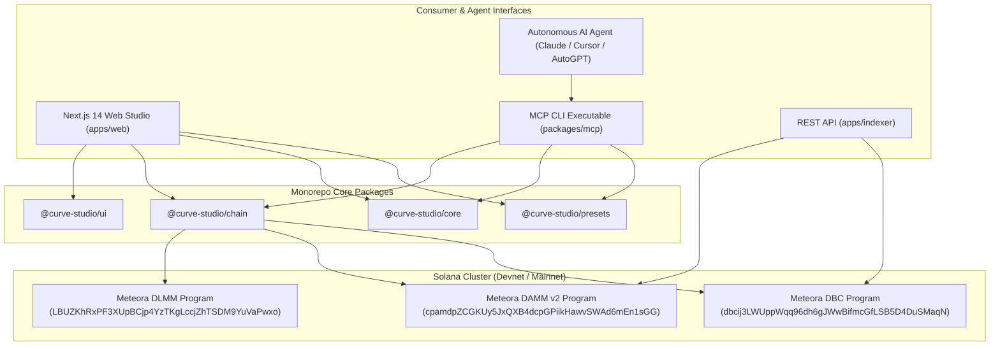
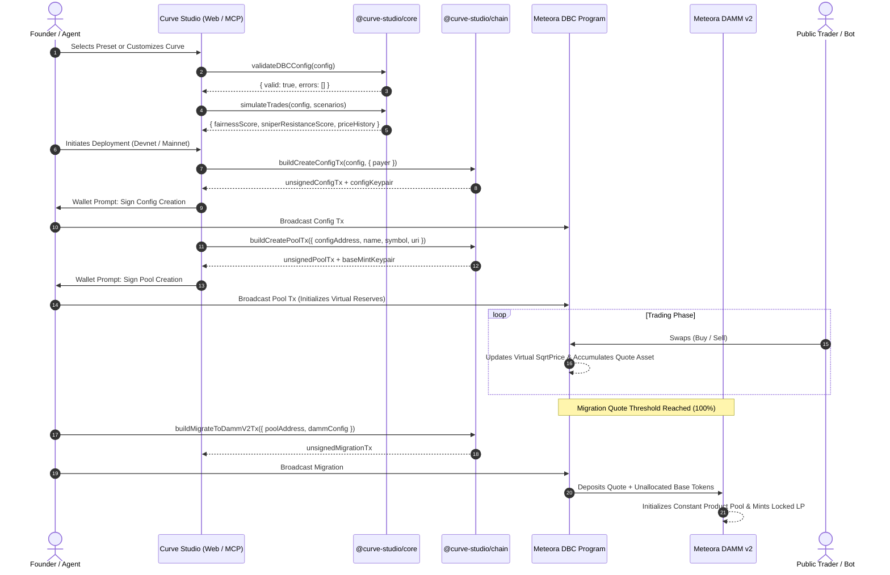

# Curve Studio: Technical Architecture & System Design 🏛️

Curve Studio is an open-source platform, financial modeling engine, and developer toolkit for launching tokens on **Meteora Dynamic Bonding Curves (DBC)** that migrate into **DAMM v2 (`cp-amm`)** and **DLMM (`lb_clmm`)** liquidity pools on Solana.

---

## 1. Architectural Philosophy

1. **Mathematical Rigor Over Heuristics**:
   - Zero floating point imprecision in core financial calculations.
   - All token math, sqrt prices, and reserve updates use `bn.js` and `decimal.js`.
2. **Zero Private Keys in Client Code**:
   - Neither the web app, MCP server, nor agent tools ever handle private keys.
   - The system produces unsigned `Transaction` envelopes with transparent required signer manifests.
3. **Meteora SDK Fidelity**:
   - Curve Studio binds directly to production `@meteora-ag/*` SDKs (`dynamic-bonding-curve-sdk` 1.5.13, `cp-amm-sdk` 1.5.1, `dlmm` 1.9.14).
   - Automated parity harnesses continuously test local simulation results against Meteora's SDK quote engine.

---

## 2. Component Topology

---

## 3. Package Structure & Responsibilities

### `@curve-studio/core`
- **Curve Math**: Bitwise-safe sqrt-price transformations, virtual constant-product curve equations, and fee splits.
- **Config Builder**: Generates valid `DBCConfig` structures with piecewise segment bounds and liquidity weights.
- **Validator**: Strictly validates all parameters against on-chain program invariants (fees $\ge 25\text{ bps}$, liquidity sum $= 100\%$, strictly monotonic segments).
- **Simulator**: Discrete multi-wallet trade simulator providing:
  - Effective average entry price across buyers.
  - Gini fairness score ($0.0 \to 1.0$) based on token holder dispersion.
  - Anti-snipe resistance score ($0 \to 100$) based on fee decay severity and price impact resilience.
  - Maximum drawdown percentage during trade cascades.

### `@curve-studio/presets`
- Exposes 5 production financial mechanisms with structured metadata, Zod schemas, and economic rationales:
  1. `stock-price-discovery`: Tokenized equities, 25 bps flat fee, 100% permanently locked DAMM v2 LP.
  2. `fair-meme`: Anti-snipe exponential fee decay (500 bps $\to$ 100 bps) over 15 minutes.
  3. `rwa-long-tail`: 4-segment accumulation curve, 15% custody/appraisal fee routing, 85% locked LP.
  4. `ai-agent-token`: 25% continuous trading fee split to autonomous compute treasury PDA.
  5. `conviction-pool`: Dual-stage migration to DAMM v2 + secondary DLMM concentrated bin staking pool.

### `@curve-studio/chain`
- **DbcAdapter**: High-level wrapper around `@meteora-ag/dynamic-bonding-curve-sdk` for constructing unsigned config, pool, swap, fee claim, and migration transactions.
- **Damm2Adapter**: Wrapper around `@meteora-ag/cp-amm-sdk` for interacting with migrated pools.
- **DlmmAdapter**: Wrapper around `@meteora-ag/dlmm` for concentrated bin conviction pools.
- **TransactionIntrospector**: Inspects compiled transaction bytecode to produce transparent human-readable previews of program IDs, signer accounts, and security warnings.
- **ParityHarness**: Automated test harness verifying numerical agreement between `@curve-studio/core` math and live Meteora SDK calculation.

### `@curve-studio/mcp`
- Model Context Protocol (MCP) server providing 7 standardized tools over JSON-RPC stdio:
  - `list_presets`: Filter curve archetypes by asset class.
  - `get_preset`: Inspect detailed preset parameters and rationale.
  - `validate_config`: Enforce on-chain DBC invariant rules.
  - `simulate_config`: Execute simulated trade flows and report slippage/drawdown.
  - `compare_configs`: Side-by-side benchmark of multiple curves.
  - `build_launch_tx`: Generate unsigned Solana launch transactions.
  - `get_pool_state`: Query live virtual reserves and migration progress.

### `apps/indexer`
- Real-time Solana RPC log monitor and pool indexer.
- Subscribes via WebSocket `onLogs` to the DBC program with exponential backoff reconnects and fallback polling.
- Ingests pool creation, swap trades, fee claims, and migration events.
- Exposes a fast HTTP REST API on `:4000` for frontend consumption.

### `apps/web`
- Production Next.js 14 App Router application with Tailwind CSS and glassmorphic dark theme.
- **Pages**:
  - `/` (Studio): Interactive piecewise curve visualizer, parameter sliders, scenario runner, live Gini fairness and sniper scores.
  - `/presets` (Marketplace): Preset catalog with instant "Load into Studio" flow.
  - `/deploy` (Deployer): 2-stage unsigned deployment pipeline with explicit `"DEPLOY TO MAINNET"` safety gate.
  - `/trade` (Trading): Swap interface with slippage controls, partial fill support, and migration progress bar.
  - `/claim` (Fee Claiming): Creator and partner fee claiming with one-click atomic execution.

---

## 4. Lifecycle of a Token Launch

---

## 5. Security & Verification Guarantees

1. **Private Key Isolation**: All wallet adapters and signing mechanisms are strictly externalized.
2. **Bytecode Introspection**: The `TransactionIntrospector` audits compiled transaction instruction bytes before prompting users to sign, mitigating malicious RPC tampering.
3. **Mainnet Gate**: Production mainnet deployments require explicit user intent via typed confirmation string `"DEPLOY TO MAINNET"`.
4. **Tested Parity**: Automated continuous testing against official Meteora SDK dependencies ensures zero divergence between simulation forecasts and on-chain execution.
